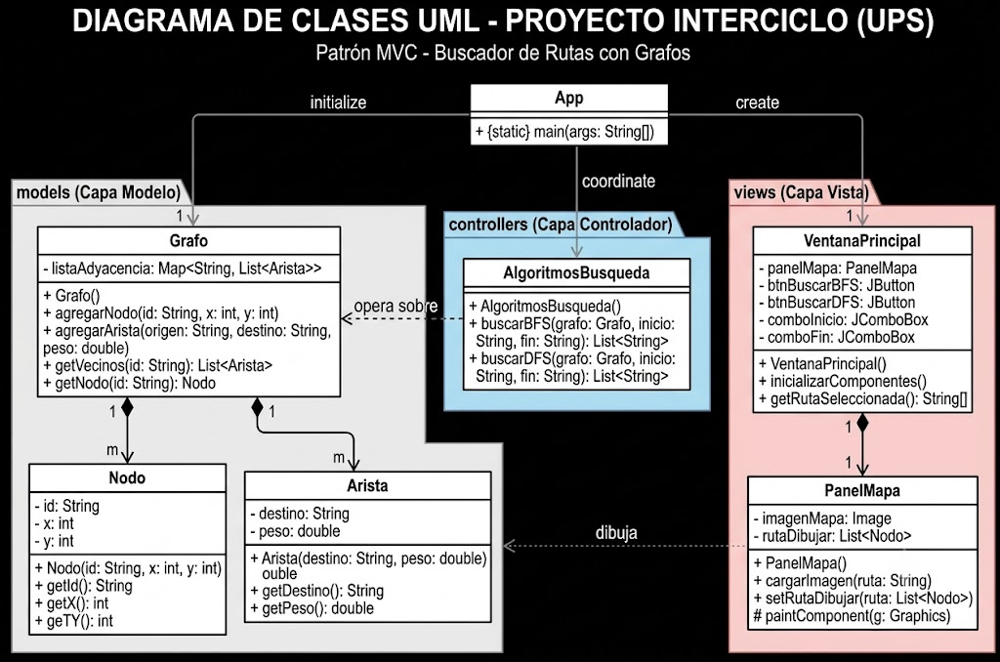
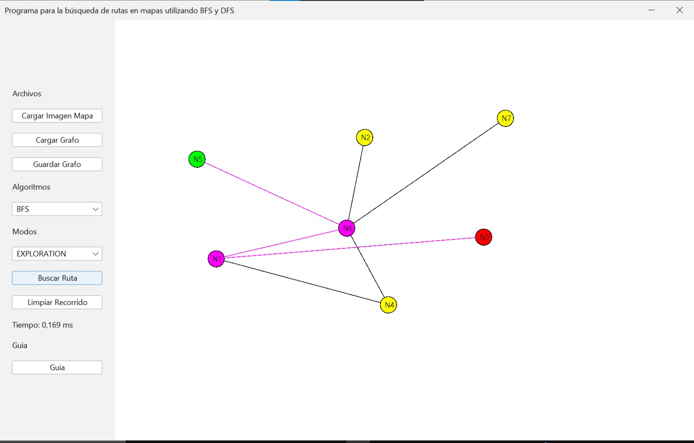
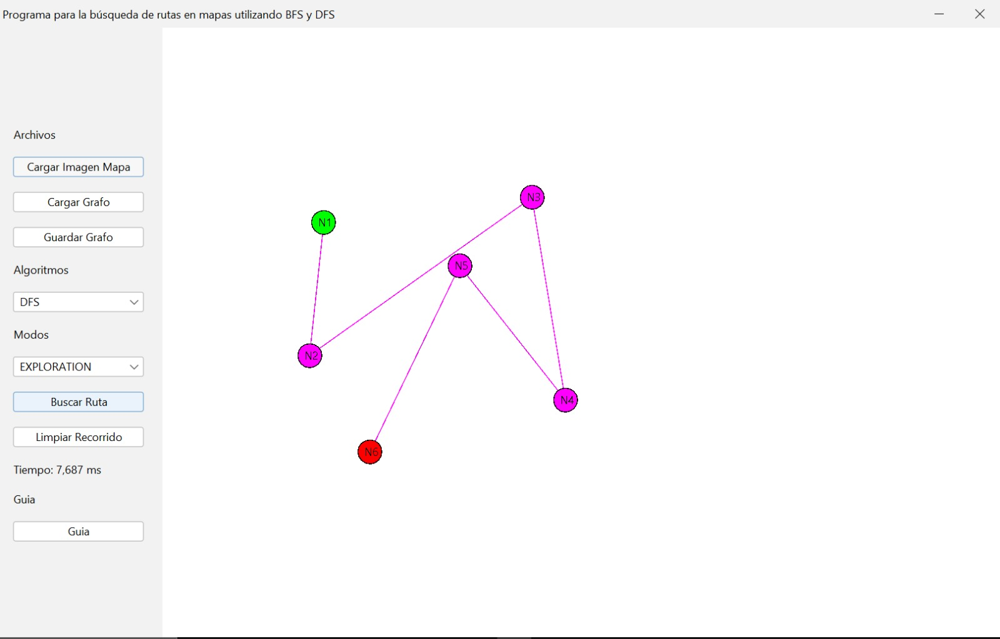

# Buscador de Rutas Óptimas en Mapas con Grafos

**Universidad Politécnica Salesiana (UPS)** **Carrera:** Ingeniería en Ciencias de la Computación  
**Asignatura:** Estructura de Datos  
**Profesor:** Ing. Pablo Torres  
**Ciclo/Periodo:** 2do Ciclo  

### Integrantes del grupo
* Renato Amaya
* Gabriel Cuenca
* Sebastian Arenillas

### Correos institucionales
* ramayas@est.ups.edu.ec
* gcuencao1@est.ups.edu.ec
* sarenillas@est.ups.edu.ec

---
## Índice
1. Objetivo
2. Marco teórico
   - Grafos
   - Búsqueda en Anchura (BFS)
   - Búsqueda en Profundidad (DFS)
3. Tecnologías utilizadas
4. Diagrama UML y explicación
5. Arquitectura del sistema
6. Funcionamiento del programa
7. Capturas del sistema
8. Explicación del algoritmo BFS
9. Comparación entre BFS y DFS
10. Conclusiones
11. Recomendaciones

---
## 1. Objetivo
Desarrollar el sistema computacional "Buscador de Rutas Óptimas en Mapas Urbanos" mediante la aplicación de fundamentos de teoría de grafos y algoritmos de búsqueda no informada. El propósito principal es modelar un entorno espacial para resolver eficientemente el problema de trazado de trayectorias entre distintos puntos, consolidando el manejo de estructuras de datos complejas bajo la arquitectura Modelo-Vista-Controlador (MVC).

---

## 2. Marco Teórico

### 2.1 Grafos
Un grafo es una estructura de datos discreta utilizada para representar relaciones entre objetos. Consiste en un conjunto de **vértices (nodos)** y un conjunto de **aristas (enlaces)** que conectan pares de vértices. En el contexto de este mapeo urbano, los nodos representan las intersecciones o puntos clave, mientras que las aristas representan las calles o caminos disponibles que los conectan.

### 2.2 Búsqueda en Anchura (BFS - Breadth-First Search)
Es un algoritmo de recorrido que comienza en un nodo origen y explora todos sus nodos vecinos a la profundidad actual antes de pasar a los nodos del siguiente nivel. 
*   **Mecanismo:** Utiliza una estructura de datos tipo **Cola (Queue)** operando bajo el principio FIFO (First In, First Out).
*   **Propósito:** Es ideal para determinar el camino más corto en grafos no ponderados (donde la distancia entre cualquier par de nodos adyacentes es constante), garantizando la ruta más óptima en cantidad de "saltos".

### 2.3 Búsqueda en Profundidad (DFS - Depth-First Search)
Es un algoritmo que prioriza explorar tan profundo como sea posible a lo largo de cada rama antes de realizar un retroceso (backtracking). 
*   **Mecanismo:** Se implementa típicamente de forma recursiva o utilizando una estructura de datos tipo **Pila (Stack)** operando bajo el principio LIFO (Last In, First Out).
*   **Propósito:** Se utiliza para explorar exhaustivamente las topologías, encontrar rutas alternativas o determinar si existe conexión entre dos puntos, aunque no garantiza que la primera ruta encontrada sea la más corta.

---

## 3. Tecnologías Utilizadas
*   **Lenguaje de Programación:** Java
*   **Arquitectura de Software:** MVC (Modelo-Vista-Controlador)
*   **Entornos de Desarrollo (IDE):** NetBeans / Visual Studio Code
*   **Control de Versiones:** Git y GitHub

---

## 4. Diagrama UML y Explicación

**Explicación de la Arquitectura y Diagrama:**
El diseño del sistema se ha estructurado dividiendo las responsabilidades lógicas para asegurar un código modular y escalable:

1.  **Capa de Modelo (`Model`):** Contiene la lógica central de las estructuras de datos. Aquí residen clases fundamentales como `Grafo`, `Nodo` (que almacena coordenadas o nombres de ubicaciones) y `Arista`. Estas clases encapsulan el estado del mapa urbano y gestionan las listas de adyacencia.
2.  **Capa de Controlador (`Controller`):** Actúa como el intermediario lógico. Incluye las clases encargadas de ejecutar los algoritmos matemáticos (BFS y DFS). Recibe las peticiones (como el punto A y el punto B), consulta al Modelo la estructura del grafo, calcula la ruta y envía los resultados procesados.
3.  **Capa de Vista (`View`):** Comprende la interfaz gráfica de usuario. Es responsable de capturar las interacciones, mostrar el mapa interactivo y renderizar visualmente el camino final calculado por el controlador.

---

## 5. Arquitectura del Sistema

El proyecto fue construido utilizando el patrón de diseño **MVC (Modelo-Vista-Controlador)** y los principios **SOLID**, garantizando un código limpio, escalable y mantenible. La estructura de paquetes es la siguiente:

* **`models`**: Contiene la abstracción pura de los datos (`MapPoint` y los estados de visualización).
* **`structures`**: Es el motor matemático del proyecto. Incluye la implementación de grafos basados en Listas de Adyacencia, envoltorios de nodos (`Node`) y el contrato `PathFinder` implementado por los algoritmos.
* **`views`**: Interfaz gráfica de usuario construida con **Java Swing**. Permite cargar mapas de fondo, conectar nodos interactivamente y visualizar animaciones de recorrido.
* **`controllers`**: (`MapController`) Actúa como el puente que procesa las interacciones del usuario en la vista y dispara los algoritmos en el modelo.
* **`persistence`**: Capa dedicada al guardado y carga de grafos desde archivos, separando esta responsabilidad del resto del sistema.

---

## 6. Funcionamiento del programa

El funcionamiento del programa es el siguiente:

1. El usuario carga una imagen del mapa.
2. Crea los nodos haciendo clic derecho sobre el mapa.
3. Conecta los nodos arrastrando uno hacia otro.
4. Selecciona un nodo de inicio y uno de destino.
5. Escoge el algoritmo BFS o DFS.
6. Selecciona el modo de visualizacion.
7. Ejecuta la busqueda.
8. El sistema muestra la animación de los nodos explorados y posteriormente la ruta encontrada.
9. Finalmente se muestra el tiempo de ejecucion del algoritmo.

---

## 7. Capturas del sistema

### Configuración 1

**Figura 1.** Ejecucion del algoritmo BFS en modo *Exploration*. El nodo verde representa el punto de inicio, el rojo el punto de destino, los nodos amarillos corresponden a los nodos explorados y la ruta encontrada se muestra en color morado.

---

### Configuración 2

**Figura 2.** Ejecucion del algoritmo DFS en modo *Exploration*. Se puede observar que el recorrido seguido por el algoritmo es diferente al de BFS debido a su estrategia de exploracion en profundidad.

---

## 8. Explicacion del algoritmo BFS

El algoritmo BFS implementado en este proyecto comienza agregando el nodo inicial a una cola y marcandolo como visitado.

Mientras existan elementos en la cola, el algoritmo extrae el primer nodo, verifica si corresponde al nodo destino y, en caso contrario, recorre todos sus vecinos.

Cada vecino que aun no ha sido visitado se agrega a la cola, se registra su nodo padre y tambien se almacena para poder mostrar posteriormente la animación de exploracion.

Una vez encontrado el nodo destino, se reconstruye la ruta utilizando el mapa de padres, recorriendo desde el nodo final hasta el nodo inicial.

Esta implementacion tambien guarda el orden de exploracion para que la interfaz grafica pueda animar paso a paso el recorrido realizado por el algoritmo.

---

## 9. Comparación entre BFS y DFS

| Caracteristica | BFS | DFS |
|----------------|-----|-----|
| Estructura utilizada | Cola (`Queue`) | Pila (`Stack`) |
| Tipo de recorrido | Por niveles | En profundidad |
| Garantiza la ruta mas corta | Sí | No |
| Orden de exploración | Vecinos primero | Una rama completa |
| Implementacion | `BFSPathFinder` | `DFSPathFinder` |

---

## 10. Conclusiones

### Renato Amaya

Durante el desarrollo de este proyecto fue posible comprender de mejor manera el funcionamiento de los grafos y como pueden utilizarse para representar mapas y conexiones entre diferentes puntos. La implementacion de los algoritmos BFS y DFS permitio reforzar los conocimientos adquiridos en clases y entender que cada algoritmo sigue una estrategia distinta para encontrar una ruta. Ademas, trabajar con la arquitectura MVC ayudó a mantener el codigo organizado, facilitando tanto el desarrollo como las pruebas de la aplicacion.

### Gabriel Cuenca

La elaboracion de este programa permitio poner en practica varias estructuras de datos vistas durante la materia, como pilas, colas, conjuntos y grafos. Al comparar el comportamiento de BFS y DFS se pudo observar que, aunque ambos encuentran una ruta valida cuando existe una conexion, el recorrido realizado por cada uno es diferente. La visualizacion paso a paso de la exploracion facilito la comprensión del funcionamiento interno de los algoritmos y permitio verificar que los resultados obtenidos eran correctos.

### Sebastian Arenillas

Este proyecto represento una buena oportunidad para aplicar los conocimientos de programacion orientada a objetos y de estructuras de datos en una aplicacion real. Ademas de desarrollar la logica de busqueda de rutas, tambien fue necesario diseñar una interfaz grafica que permitiera interactuar facilmente con el programa, lo que hizo el proyecto mas completo. Finalmente, el trabajo en equipo permitio distribuir las tareas, resolver problemas durante el desarrollo y obtener una aplicacion funcional que cumple con todos los requisitos establecidos para el proyecto.

---

## 11. Recomendaciones

- Implementar una opcion para eliminar nodos o conexiones sin necesidad de reiniciar todo el grafo.

- Agregar la posibilidad de mover los nodos dentro del mapa para facilitar la edicion de las rutas.

- Permitir cambiar el color de los nodos y de las rutas para mejorar la visualizacion del recorrido.

- Incorporar informacion adicional en los nodos, como nombres o descripciones de cada ubicacion del mapa.

